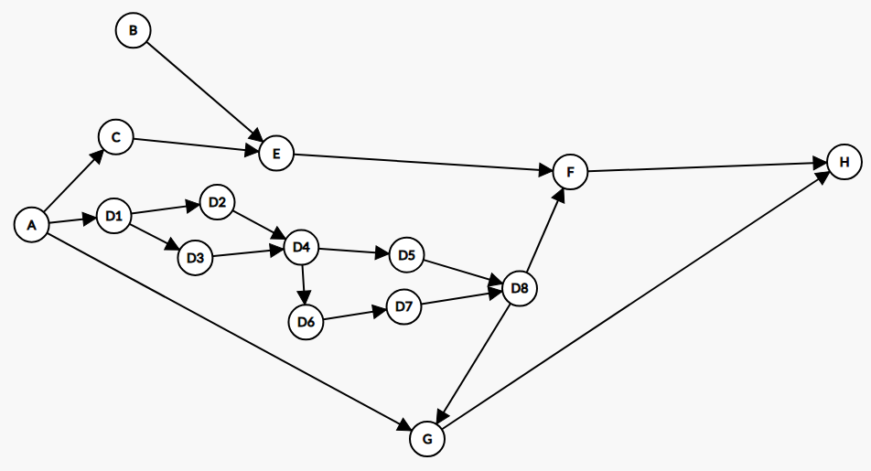
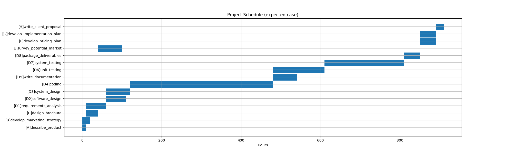
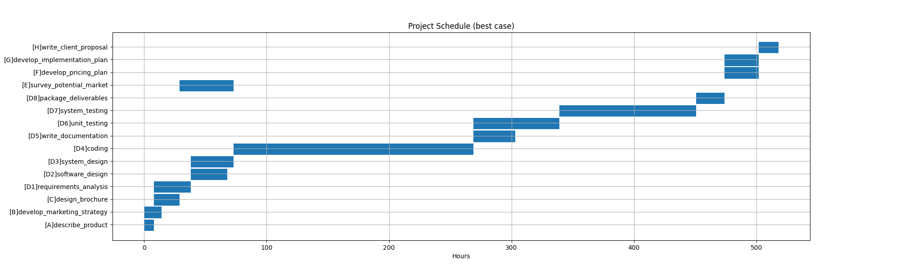
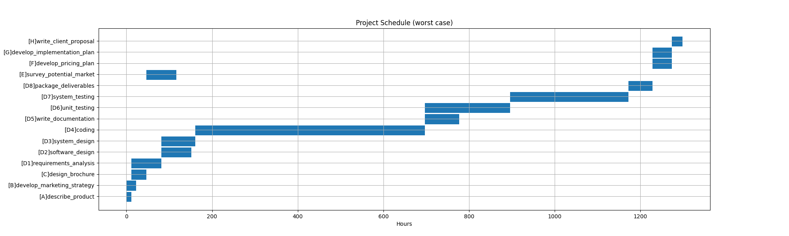

# MSDS-460 Assignment 2
## Jeremy Cruz

### Part 1

#### Planning

For the plan I used the worker columns to help me estimate the expected hours for each project. In my experience frontend and backend engineers are really bad at estimating their own work, product managers are good at estimating, and I'm assuming data scientsts and engineers are good as well. To calculate the best case scenario I used the following formula `=ROUNDUP(0.5 * (SUM(backendDev,frontendDev)) + 0.8 * (SUM(projectManager)) +0.6 * (SUM(dataScientist,dataEngineer)))`. For the worst case I used `=ROUNDUP(1.8 * (SUM(backendDev,frontendDev)) + 1.2 * (SUM(projectManager)) + 1.1 * (SUM(dataScientist,dataEngineer)))`. Originally I just multiplied the expected case by a random number for the best and worst cases, but the visualization ended up being the same but scaled.

#### Graph

With this graph we can see that tasks A and B can be immediately started. Once task A is complete, work can begin on C and D1. In development (D1-D8) there are many tasks that can be completed simultaniously and but eventually need work done in the other tasks in order to continue. Fully completing development work (D8) is guaranteed to unblock task G and may unblock task F if E is complete. Task H is dependent all prior tasks being completed before it can begin.C:\Users\19168\School\460-DA\a2\data\updated-sheet.png

### Part 2
#### Model

This is the model for the problem where `x_i` is the start time for `i` and `d_i` is the duration of the task. We want to minimize the end time `z` and ultimately the cost assuming that everyone makes the same hourly rate.

### Part 3
#### Running Code

- Ensure you have the packages installed.
- Run `./cpath.py (args)`
    - `-w` for worst case
    - `-b` for best case
    - leave empty for expected

#### Files

- [Expected Case Text](./data/expected-case.txt) 910 hours
- [Best Case Text](./data/best-case.txt) 518 hours
- [Worst Case Text](./data/worst-case.txt) 1298 hours

### Part 4
#### Solutions

The solutions look mostly the same but with the hours scaled differently. One thing that stands out is that in the best case scenario task E (surveying potential market) overlaps with coding which it doesn't in the other two cases.

### Part 5

#### Proposal
Based on the results the project would take about 33 work weeks in the worst case so I would tell the customer it would take that long. I'm not entirely sure how contracting works but I would charge double whatever it would cost me to have 1300 hours of work so I can make some money.

If I were to add developers I'm sure that the development time would decrease drastically. It wouldn't be a linear relationship so I couldn't throw 500 developers at the prototype to make it 500 x faster. But its also important to note that even with a faster prototype development more developers would have to join other tasks such as planning and costs would increase there.

